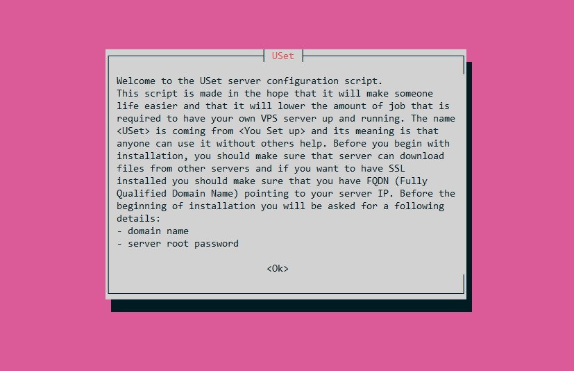

<p align="center">
  
</p>

# USet
Server configuration script

> IMPORTANT NOTICE: Version 2.0 is here! 
> There are many changes and improvements in this release, but the two biggest are ability to translate interface and configuration options for those with specific needs. 
> You can check [Change Log](./CHANGELOG.md) to find out details. 

Minimum required Ubuntu version: 18.04

### Running the script

```
git clone https://github.com/sitemapxml/uset.git
cd uset
chmod +x uset
./uset
```
After running the script, you should see welcome screen like this:
<p align="center">
  
</p>

If you want to save screen output you can do it simply by using tee command:

```
./uset | tee log.txt
```
If you do so, it is advisable to turn off screen coloring by changing `$conf_disable_colors` to `true`

Before running the script you should check if the name servers point to your server IP address. The easiest way to do it, is by using `host` command:

```
host example.com
```

Which will return:
`example.com has address 93.184.216.34`

If you don't see your IP, or you get something like this: `Host example.com not found: 3(NXDOMAIN)`

It means that DNS propagation is not complete and you probably need to wait until it's done. Configuring the server without domain name is possible, but in that case you won't be able to install `Let's Encrypt` SSL certificate.

### Configuration options
If you want to fine-tune installation options, you can edit `config.txt`
<br>Configuration file must be edited before running the script, otherwise it would not take effect.

If you use this script often, you probably don't want to see welcome screen.
<br>Welcome screen can be turned off by setting `conf_skip_welcome_screen` to `true` in config file.

Individual options will be documented in some of the future releases.

### Wordpress installation
Wordpress installation option is included by-default, so to install wordpress only thing you need to do is choose `Yes` when the prompt show up.

If Wordpress installation is chosen, database will be automatically created.
Database credentials would be then stored in a file named according to `conf_db_info_file_name` variable. Default name is `db-info.txt`

If you choose **not** to install Wordpress, then the script will create `index.html` and `info.php` file so you can immediately access website from your browser.

### Password backup file
The last option is to choose if you want to save usernames and passwords in a text file.
The passwords are saved in plain text, so this is not recommended but sometimes can be useful. Passwords will be saved to a file named `data.txt` inside directory `.data`

### Language settings
USet supports localization, so if you want to localize it to your own language, you can copy english translation inside `files/languages/en.txt` and name it according to your preferences.

### Uninstall options
To uninstall installed software you can run `uninstall` file inside `files` directory.

---

### Contributions and License

If you experience any bug or you have some idea for improvement, feel free to open up new issue, or if you are familiar with bash you can fork the repository and open up a pull request.

License is MIT, so you are free to use it in both personal and commercial purposes according to the terms of the [License](./LICENSE).
