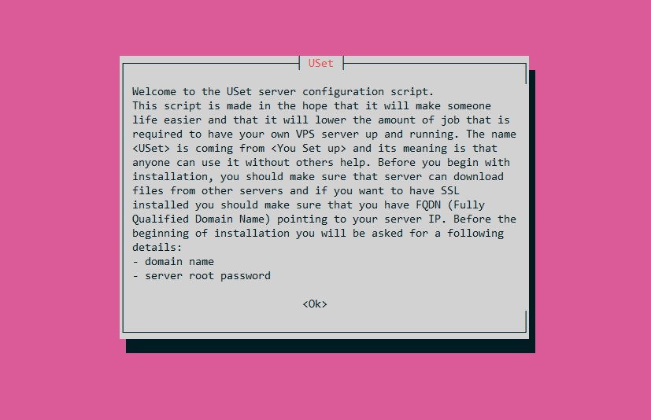

<p align="center">
  
</p>

[](https://github.com/sitemapxml/)

[](https://github.com/sitemapxml/USet/issues)
[](https://github.com/sitemapxml/uset/releases/tag/3.0.0)

[](https://www.gnu.org/software/bash/)
[](https://github.com/sitemapxml/uset/blob/master/LICENSE)

# USet
Server configuration script

> IMPORTANT NOTICE: Version 3.0 is here! :confetti_ball: :confetti_ball: :confetti_ball:
> This is the biggest update from the beginning of this project. There are many improvements in this release, but most notable are full support for command line options, support for configuration files, custom scripts, installation profiles, and completely revised project structure.
> You can check [Change Log](./CHANGELOG.md) for more details.

Supported systems:

<table align="center">
<thead>
  <tr>
    <th>OS<br></th>
    <th></th>
    <th></th>
  </tr>
</thead>
<tbody>
  <tr>
    <td><b>VERSION</b></td>
    <td>9 or newer</td>
    <td>18 or newer</td>
  </tr>
</tbody>
</table>


### Running the script

```
git clone https://github.com/sitemapxml/uset.git && cd uset && chmod +x uset
./uset
```
After running the script, you should see welcome screen like this:
<p align="center">
  
</p>

If you want to save screen output you can do it simply by using tee command:

```
./uset | tee log.txt
```

If you do so, it is advisable to turn off screen coloring by passing `--colors no` option.

Before running the script you should check if the name servers point to your server IP address. The easiest way to do it, is by using `host` command:

```
host example.com
```

Which will return:
`example.com has address 93.184.216.34`

If you don't see your IP, or you get something like this: `Host example.com not found: 3(NXDOMAIN)`

It means that DNS propagation is not complete and you probably need to wait until it's done. Configuring the server without domain name is possible, but in that case you won't be able to install `Let's Encrypt` SSL certificate.

### Configuration options
If you want to fine-tune installation options, you can edit `default.conf` file inside `config` directory, or by passing [apropriate options]().
<br>Configuration file must be edited before running the script, otherwise it would not take effect.

If you use this script often, you probably don't want to see welcome screen.
<br>Welcome screen can be turned off by passing `--welcome no` option.

### Password backup file
The script will automatically save usernames and passwords in a text file.
You can disable this behavior by using the `--save-passwords no` option.
The passwords are saved in plain text, so this is not recommended but sometimes can be useful. Passwords will be saved to a file named `data.txt` inside directory `.data`

### Language settings
USet supports localization, so if you want to localize it to your own language, you can copy english translation inside `languages/en.txt` and name it according to your preferences.

If you want to contribute to the project by making translations, then filename of the translation file should be two letter language code following [ISO 639-1](https://en.wikipedia.org/wiki/List_of_ISO_639-1_codes)

### Uninstall options
To uninstall installed software you can run `uninstall.sh` file inside `tools` directory.

### History
This script is made from two repositories: [LAMP](https://github.com/sitemapxml/lamp) and [LEMP](https://github.com/sitemapxml/lemp) which were merged into one repository called [uset_alfa](https://github.com/sitemapxml/uset_alfa), from which is this project created. LAMP was first created and LEMP was created as a fork of LAMP which were adjusted to [NGINX](https://www.nginx.com/).
Version [1.3.2](https://github.com/sitemapxml/lamp/tree/37a1456a00fb7312fb70249ead993d347a25bab8) of LAMP script is used as beginning version of USet family, so LAMP repository is not under active development anymore, but it will
remain public anyway.

---

### Contributions and License

If you experience any bug or you have some idea for improvement, feel free to open up new issue, or if you are familiar with bash you can fork the repository and open up a pull request.

Before submitting new changes, please read [Contributing guidelines](./CONTRIBUTING.md)

License is MIT, so you are free to use it in both personal and commercial purposes according to the terms of the [License](./LICENSE).
